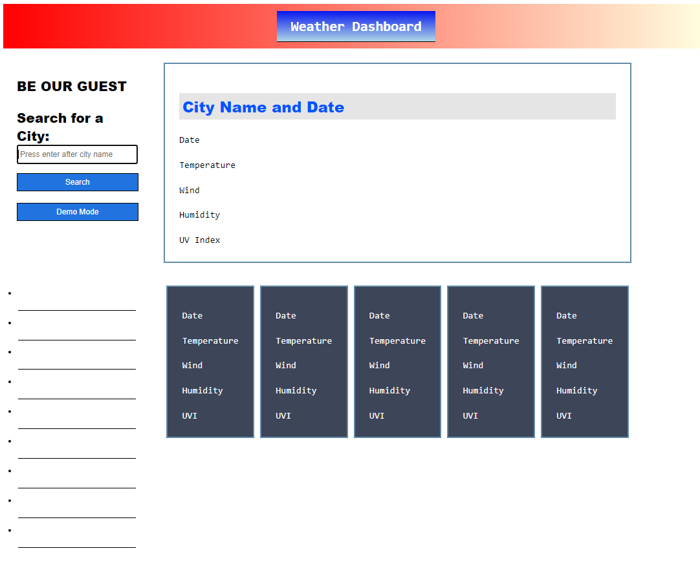
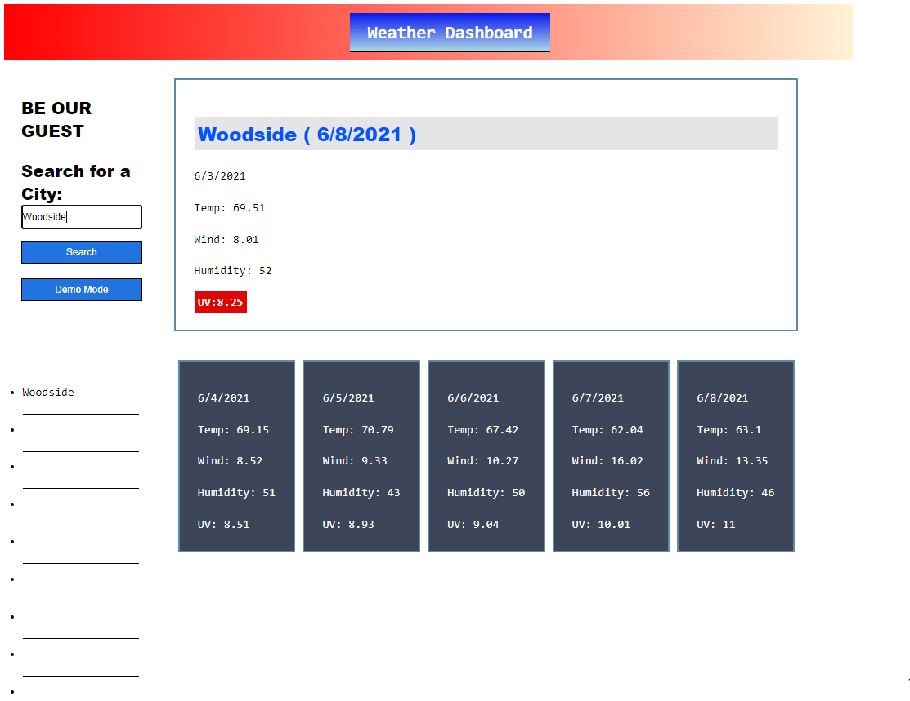
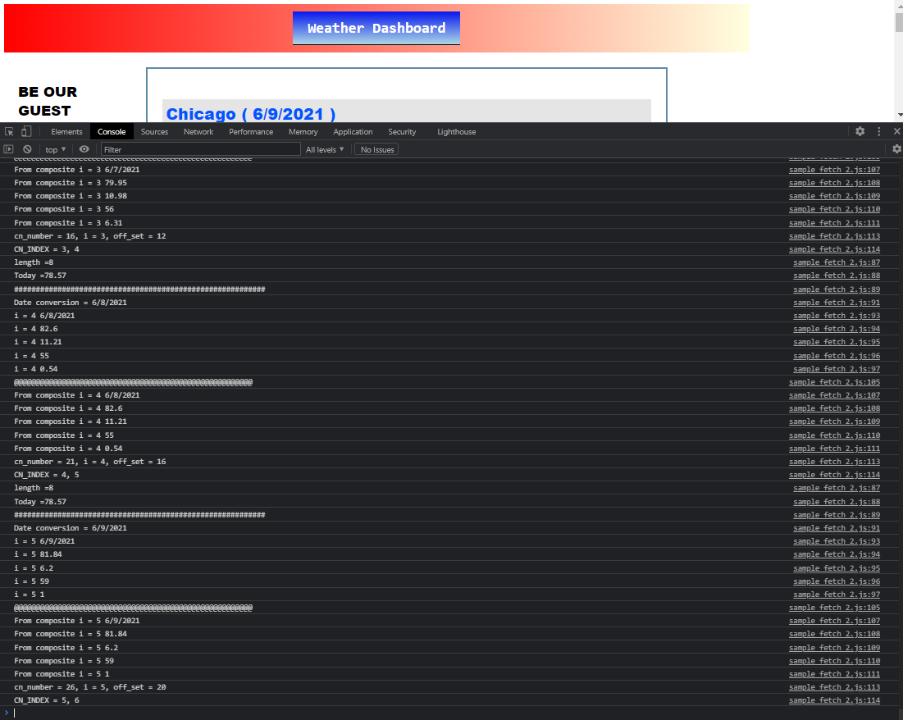
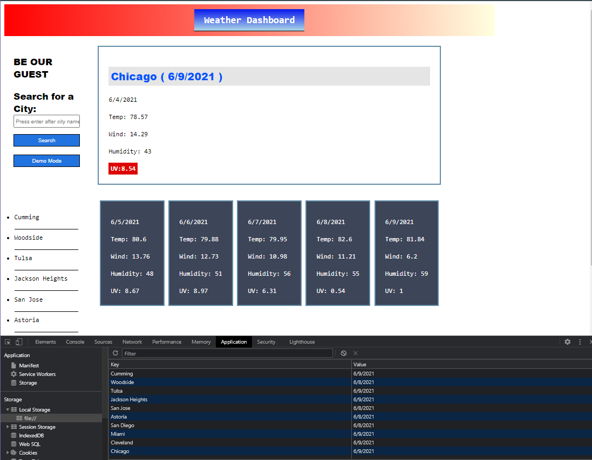
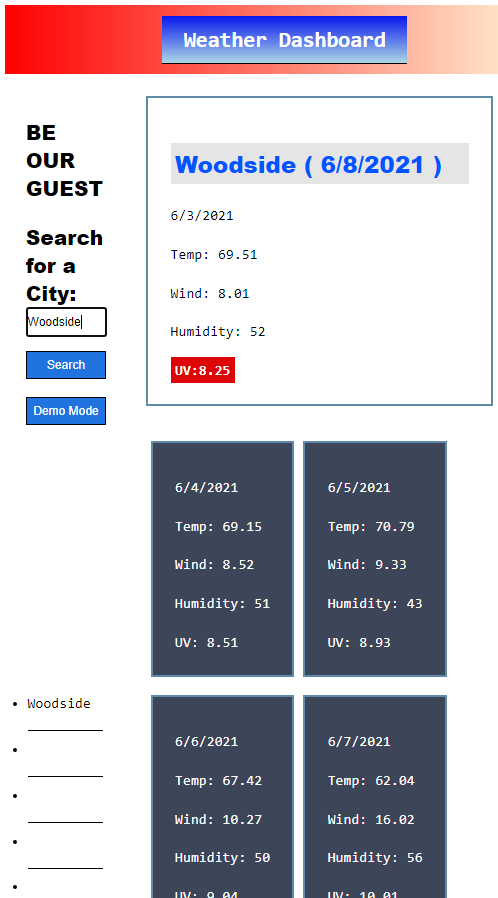
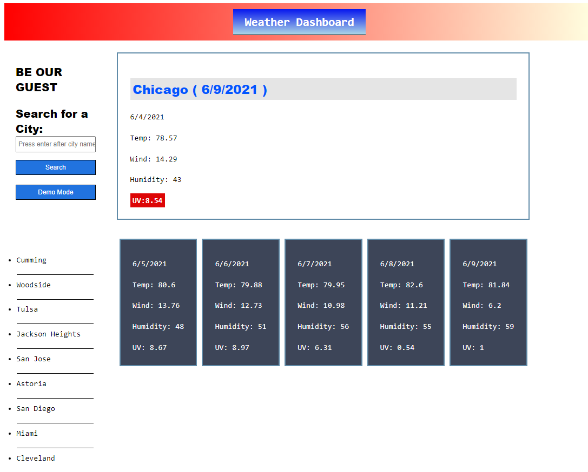

# WeatherDashBoard


* Link access to the "The One Day Scheduler" [Published Link](https://xtended99.github.io/WeatherDashBoard/).
* Link access to the project page for "The One Day Scheduler" [Repository Link](https://github.com/Xtended99/WeatherDashBoard).


## Your Task

```
Build an interface that makes use of third party API  
The idea is to get practice updating the UI. This project has been built using  
Plain Vanilla JavaScript and zero third party API's.  

```

## User Story

```
AS A traveler I WANT to see the weather outlook for multiple cities  
SO THAT I can plan a trip accordingly  
```

## Acceptance Criteria

```
GIVEN a weather dashboard with form inputs
WHEN I search for a city
THEN I am presented with current and future conditions for that city and that city is added to the search history
WHEN I view current weather conditions for that city
THEN I am presented with the city name, the date, an icon representation of weather conditions, the temperature, the humidity, the wind speed, and the UV index
WHEN I view the UV index
THEN I am presented with a color that indicates whether the conditions are favorable, moderate, or severe
WHEN I view future weather conditions for that city
THEN I am presented with a 5-day forecast that displays the date, an icon representation of weather conditions, the temperature, the wind speed, and the humidity
WHEN I click on a city in the search history
THEN I am again presented with current and future conditions for that city
```

### Program Details

```
_______________________________________________________________________

Premise:

 * The entire UI is derived entirely from plain vanila JavaScript.  
 * If you look at the HTML all you will see is a minimal amount of HTML  
 * All there is skeleton code for an HTML page.  
 * The UI is dynamically modified when the name_to__lon and the get_info function executes.  

 The UI is starts with a completely blank Weather dashboard.  
 * The data is persisted to storage and the data will be available for inspection.
 
Features included:

 *   The only input field on the page gets to be the star and recives automatic focus. 
 *   The input will respond to the enter key and can act as a botton simply by pressing the enter key.  

 *   Main features:  
 *     1. Search botton and search input field can execute for single quries.  
 *     2. Built in live demonstration mode with live queries.  
 *     3. Left hand list is mouse sensitive and will execute on the city listed from a 
 *         previous search
 *     4. UI will shrink as much as possible to accomodate smaller devices.  
 *     5. Data is saved to disk  
 *     6. UV indicator paired up with color coding to signal visually the levels of the
 *           UV index.  
 *     7. 6 Day forcast 
 *     8. Present day is posted at the very top of the page.

 
TODOS:

 *   Inclcude images that that help understand the type of day. 
 
Please:
 *   View the index.html, main.css and heavy_lifting.js for code details.

Thank You
     Angel Sosa
Enjoy!!!
 _______________________________________________________________________
```

### <span style="color:blue">**Application Images:**</span>
  
  
### **Using the application for the first time**   
      
  
  
  
### **Searching for a single city**  
     
  
  
  
### **Showing Developer Tools Ouptut for debbuging and validation purposes**   
     
  
  
  
### **Showing Storage view**   
     
  
  
### **Compact View**   
     
 

### **Hands off view**   
     


